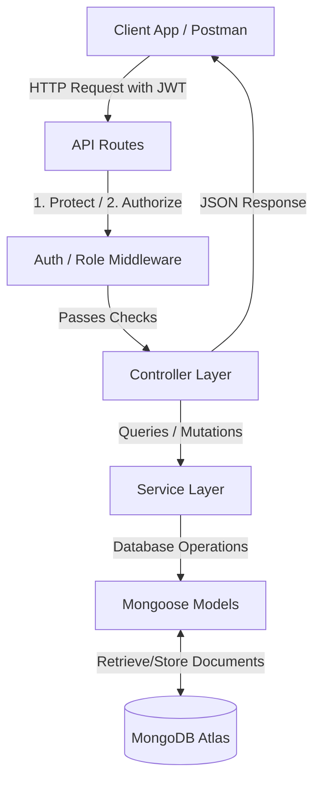

# 🎨 Kala Kosh Backend - Nepal Handicrafts E-commerce Platform

Kala Kosh is a specialized e-commerce platform built to promote local Nepalese handicrafts, connecting local artisans (vendors) with buyers. The backend provides a secure, scalable RESTful API with role-based access control, automated rating aggregation, sequential order tracking, and media upload capability.

---

## 🛠️ Technology Stack

| Technology | Purpose | Key Details |
| :--- | :--- | :--- |
| **Node.js** | Runtime Environment | JavaScript execution on the server |
| **Express.js** | Backend Web Framework | API routing, middlewares, and request handlers |
| **MongoDB** | Database | NoSQL document-based data storage |
| **Mongoose** | ODM (Object Document Mapper) | Schema validation, hooks, and database modeling |
| **JWT (JSON Web Token)** | Session Security | Stateless client-server authorization |
| **bcryptjs** | Security | Cryptographic password hashing |
| **Multer & Cloudinary** | Media Storage | Direct image parsing and cloud hosting |

---

## 🏗️ Architectural Flow: Request-Response Lifecycle

The backend is structured around the **MVC (Model-View-Controller)** pattern:



---

## 🔐 1. User Registration, Authentication & Login

Authentication is stateless and uses **JWT** tokens. Passwords are encrypted before storing in the database.

### 👤 User Registration
- **Endpoint**: `POST /api/auth/register`
- **Access**: Public
- **Request Body**:
  ```json
  {
    "name": "Binod Thapa",
    "email": "binod@kalakosh.com",
    "password": "securepassword123",
    "role": "user" 
  }
  ```
  *(Note: Valid roles are `user` (default), `vendor`, and `admin`)*
- **Database Hook (Pre-Save)**:
  Before saving a user, the Mongoose pre-save hook automatically hashes the password using `bcryptjs` (salt factor 10).
- **Response (201 Created)**:
  ```json
  {
    "success": true,
    "token": "eyJhbGciOiJIUzI1NiIsInR5cCI6Ik...",
    "user": {
      "_id": "60d21b4667d0d8992e610c11",
      "name": "Binod Thapa",
      "email": "binod@kalakosh.com",
      "role": "user",
      "is_verified": false,
      "is_active": true
    }
  }
  ```

### 🔑 User Login
- **Endpoint**: `POST /api/auth/login`
- **Access**: Public
- **Request Body**:
  ```json
  {
    "email": "binod@kalakosh.com",
    "password": "securepassword123"
  }
  ```
- **Authentication Flow**:
  1. Searches for user by `email`.
  2. Compares the plain-text password with the database hash using the `comparePassword` schema method.
  3. Verifies if the account is active (`is_active: true`).
  4. Generates a signed JWT containing the user `id` (using `process.env.JWT_SECRET`), expiring in `7d`.
- **Response (200 OK)**:
  ```json
  {
    "success": true,
    "token": "eyJhbGciOiJIUzI1NiIsInR5cCI6Ik...",
    "user": { ... }
  }
  ```

---

## 👥 2. Role Definitions & Access Control (Authorization)

Kala Kosh implements **Role-Based Access Control (RBAC)** to ensure users can only perform operations suitable for their permissions.

### Roles Matrix
- **`user`**: Default role. Can browse products, view categories, add items to cart/wishlist, make purchases, and post reviews.
- **`vendor`**: Local Nepalese artisan. Can register a shop, add/update/delete their own products, view reviews, upload photos, and update stock.
- **`admin`**: System administrator. Full database control. Can create/modify/delete categories, suspend users/vendors, override any product data, and delete any offensive reviews.

### Middleware Enforcers
1. **`protect` (Authentication)**: Validates the incoming JWT token in the `Authorization` header (`Bearer <token>`). If valid, populates the request user object (`req.user`) with the user's details.
2. **`authorize(...roles)` (Authorization)**: Compares `req.user.role` against the list of authorized roles. If the role doesn't match, it blocks execution and returns a `403 Forbidden` response.

> [!NOTE]
> All mutations (creating, updating, deleting) on categories require `admin` role, whereas product mutations require either `vendor` or `admin` roles.

---

## 🏢 3. Profile Creation: Connecting Users & Vendors

Every vendor on the platform is associated with a primary **User** account, but also holds a separate **Vendor** profile containing tax, bank, and shop details.

### The Vendor Profile Model (`Vendor.model.js`)
A vendor profile is linked to a user using a 1-to-1 reference:
```javascript
user_id: {
  type: mongoose.Schema.Types.ObjectId,
  ref: "User",
  unique: true,
  required: true
}
```

### Profile Validation Checks
- **PAN Number Validation**: Nepali tax compliance requires a 9-digit PAN number. Mongoose enforces this via a regex validator:
  ```javascript
  validate: {
    validator: (v) => /^\d{9}$/.test(v),
    message: "Must be a valid 9-digit PAN number!"
  }
  ```
- **Bank Details**: Payment aggregation requires bank name, account holder name, account number, and branch.
- **Verification Status**: Newly created vendor profiles default to `status: "pending"`. Admins must review and change this to `"active"` before the vendor can activate their products.

---

## 📂 4. Category Hierarchies

Categories structure Nepalese handicrafts (e.g., *Woodcarvings, Lokta Paper Products, Woolen Handicrafts*).

### Category Creation (Admin Only)
- **Endpoint**: `POST /api/categories`
- **Request Body**:
  ```json
  {
    "name": "Lokta Paper Products",
    "image": "http://cloudinary.com/lokta.jpg"
  }
  ```
- **Automated Slugification Hook**:
  Mongoose automatically intercepts category creations and updates to generate SEO-friendly slugs:
  ```javascript
  categorySchema.pre("validate", function() {
    if (this.name && this.isModified("name")) {
      this.slug = this.name.toLowerCase().trim().replace(/[^\w\s-]/g, "").replace(/[\s_]+/g, "-");
    }
  });
  ```
  *(e.g., "Lokta Paper Products" becomes "lokta-paper-products")*

### Category Fetching (Public Access)
- **Get All Categories**: `GET /api/categories` (Returns category array with automatically populated slugs).
- **Get Category by ID**: `GET /api/categories/:id`.

---

## 🎨 5. Product CRUD Operations & Queries

The product catalog contains rich artisan metadata (materials used, crafting regions, etc.) and is subject to strict ownership constraints.

### ➕ Create Product
- **Endpoint**: `POST /api/products`
- **Access**: Protected (Requires `vendor` or `admin` role)
- **Workflow**:
  1. The controller verifies if the authenticated user has a verified `Vendor` profile.
  2. Map the category string (or ID) to a valid `Category` ID in the database.
  3. Product is created with `status: "pending"` by default.
- **Request Body**:
  ```json
  {
    "name": "Handmade Lokta Diary",
    "description": "Premium Lokta notebook crafted in Solukhumbu.",
    "price": 850,
    "stock": 30,
    "category": "Lokta Paper Products",
    "region": "Solukhumbu",
    "material": "Lokta Bark",
    "craft_type": "Traditional Paper Craft"
  }
  ```

### 🔍 Read / Fetch Products (Public Access)
- **Get Paginated Products**: `GET /api/products?page=1&limit=12&sort=-price`
  - Supports filters like `?minPrice=500&maxPrice=1500`, `?category=<category_id_or_name>`, `?region=Patan`, `?material=Brass`.
  - Supports sorting: `price` (low to high), `-price` (high to low), `rating` (highest rated first), `newest`.
- **Text Search**: `GET /api/products/search?q=lokta`
  - Leverages Mongoose `$text` index over name, description, and region to return fast search matches.
- **Get Featured Products**: `GET /api/products/featured` (Returns top 8 products sorted by rating).
- **Get Single Product**: `GET /api/products/:id` (Returns details, populated category, vendor profile, and all product reviews).
- **Get Products by Category Name**: `GET /api/products/category/:name` (Finds products using category slug/name).
- **Get Products by Artisan**: `GET /api/products/artisan/:id` (Finds all active products uploaded by a vendor profile).

### 📝 Update Product (Ownership Enforced)
- **Endpoint**: `PUT /api/products/:id`
- **Access**: Protected (Owner Vendor or Admin Only)
- **Authorization Validation**:
  ```javascript
  const productVendorId = product.vendor_id._id.toString();
  const vendor = await Vendor.findOne({ user_id: req.user._id });
  if (req.user.role !== "admin" && (!vendor || productVendorId !== vendor._id.toString())) {
     return res.status(403).json({ message: "Not authorized to update this product" });
  }
  ```
  *(This prevents vendors from modifying products belonging to other vendors).*

### ❌ Delete Product
- **Endpoint**: `DELETE /api/products/:id`
- **Access**: Admin Only
- **Details**: Deletes the product from the database and calls Cloudinary to delete the corresponding images.

---

## 🛠️ 6. Admin Panel Management

Admins maintain the health and safety of the platform.

### Product Approval / Listing Moderation
Newly added products are pending by default. Admins approve or reject them:
- **Endpoint**: `PUT /api/products/:id/approve`
- **Access**: Admin Only
- **Body**:
  ```json
  { "status": "active" } 
  ```

### Review Moderation
Admins can delete any spam, fake, or abusive review left on products:
- **Endpoint**: `DELETE /api/products/:id/reviews/:reviewId`
- **Access**: Admin / Review Owner

---

## 🏬 7. Vendor Specific Actions

Vendors can manage their inventory, add images, and track stock.

### Multi-Image Uploads
Vendors can upload up to 5 images per product. Handled via `multer` parsing file buffers, streaming to Cloudinary:
- **Endpoint**: `POST /api/products/:id/images`
- **Access**: Product Owner / Admin
- **Request**: Multipart Form Data with image file array.

### Stock Management
Vendors can quickly patch their inventory stock:
- **Endpoint**: `PATCH /api/products/:id/stock`
- **Request Body**:
  ```json
  { "stock": 50 }
  ```
- **Validation**: Enforces non-negative numbers.

---

## ⭐ 8. Automated Rating Calculations

To keep ratings secure and automated:
1. **One-Review Limit**: Users are restricted to one review per product using a compound unique database index (`user_id` + `product_id`).
2. **Post-Save and Post-Delete Hooks**: Whenever a user saves or deletes a review, the Review model automatically runs a Mongoose `post` hook to recalculate the average rating of the product:
   ```javascript
   reviewSchema.post("save", async function() {
     await this.constructor.calculateAverageRating(this.product_id);
   });
   ```
   This performs a MongoDB aggregation (`$avg` rating) and writes the new `avg_rating` directly to the `Product` document.

---

## 🛣️ Complete Endpoint Registry

### 🔑 Auth APIs (`/api/auth`)
| Method | Endpoint | Access | Body Parameters | Description |
| :--- | :--- | :--- | :--- | :--- |
| `POST` | `/api/auth/register` | Public | `name, email, password, role` | Register user account |
| `POST` | `/api/auth/login` | Public | `email, password` | Authenticate credentials and return token |
| `POST` | `/api/auth/forgot-password` | Public | `email` | Generate and email 6-digit OTP |
| `PUT` | `/api/auth/reset-password` | Public | `otp, password` | Reset password using valid OTP code |
| `GET` | `/api/auth/me` | Protected | None | Retrieve user profile details |
| `POST` | `/api/auth/vendor` | Protected (Vendor) | `shop_name, pan_number, bank_details` | Create a vendor profile for user |
| `PUT` | `/api/auth/vendor/:id/status` | Admin Only | `status` | Update vendor profile status |

### 📂 Category APIs (`/api/categories`)
| Method | Endpoint | Access | Description |
| :--- | :--- | :--- | :--- |
| `GET` | `/api/categories` | Public | Retrieve list of categories |
| `GET` | `/api/categories/:id` | Public | Get specific category details |
| `POST` | `/api/categories` | Admin Only | Create new category (Slug auto-generated) |
| `PUT` | `/api/categories/:id` | Admin Only | Update category name / image / status |
| `DELETE` | `/api/categories/:id` | Admin Only | Delete category |

### 🎨 Product APIs (`/api/products`)
| Method | Endpoint | Access | Query / Body Params | Description |
| :--- | :--- | :--- | :--- | :--- |
| `GET` | `/api/products` | Public | `page, limit, category, sort` | Get paginated list of active products |
| `GET` | `/api/products/search` | Public | `q` | Full text search on name/desc/region |
| `GET` | `/api/products/featured` | Public | None | Get top 8 active products sorted by rating |
| `GET` | `/api/products/category/:name`| Public | None | Get all products belonging to category name |
| `GET` | `/api/products/artisan/:id` | Public | None | Get all products by Vendor profile ID |
| `GET` | `/api/products/:id` | Public | None | Get single product with reviews populated |
| `POST` | `/api/products` | Vendor / Admin | `name, description, price, stock, category` | Create a new pending product listing |
| `PUT` | `/api/products/:id` | Owner / Admin | `name, price, stock, category, region` | Edit product information |
| `PUT` | `/api/products/:id/approve` | Admin Only | `status` (active/inactive) | Approve or suspend a product listing |
| `DELETE` | `/api/products/:id` | Admin Only | None | Remove product and all Cloudinary images |
| `POST` | `/api/products/:id/images` | Owner / Admin | `files` array (images) | Upload extra images to product |
| `DELETE`| `/api/products/:id/images/:imageId`| Owner / Admin| None | Delete specific image from product |
| `PATCH` | `/api/products/:id/stock` | Owner / Admin | `stock` | Update product inventory quantity |

### ⭐ Review APIs (`/api/products/:id/reviews`)
| Method | Endpoint | Access | Body Parameters | Description |
| :--- | :--- | :--- | :--- | :--- |
| `GET` | `/api/products/:id/reviews` | Public | None | Get all reviews for a product |
| `POST` | `/api/products/:id/reviews` | Buyer Only | `rating` (1-5), `comment` | Post product review (Recalculates rating) |
| `DELETE`| `/api/products/:id/reviews/:reviewId`| Owner / Admin| None | Delete review (Recalculates rating) |

---

## ⚡ Running & Testing the Workspace

### 1. Launch Dev Server
Ensure your environment variables are configured in `.env` (including `PORT`, `MONGODB_URI`, and `JWT_SECRET`), then execute:
```bash
npm run dev
```

### 2. Run Integration Verifier
We have included a custom integration script that maps and tests imports, libraries, database connections, and routes registration. Run it using:
```bash
node src/utils/testProductModule.js
```

### 3. Run Validation Tests
To run structural validations on all Mongoose schemas (User, Vendor, Category, Product, Order, OrderItem, Cart, Wishlist, Review) including hooks and static methods:
```bash
node src/utils/testModels.js
```

### 4. Run Authentication & Middleware Tests
To run end-to-end testing on registration, login, forgot password OTP generation, JWT session protection, and global error handling:
```bash
node src/utils/testAuth.js
```
